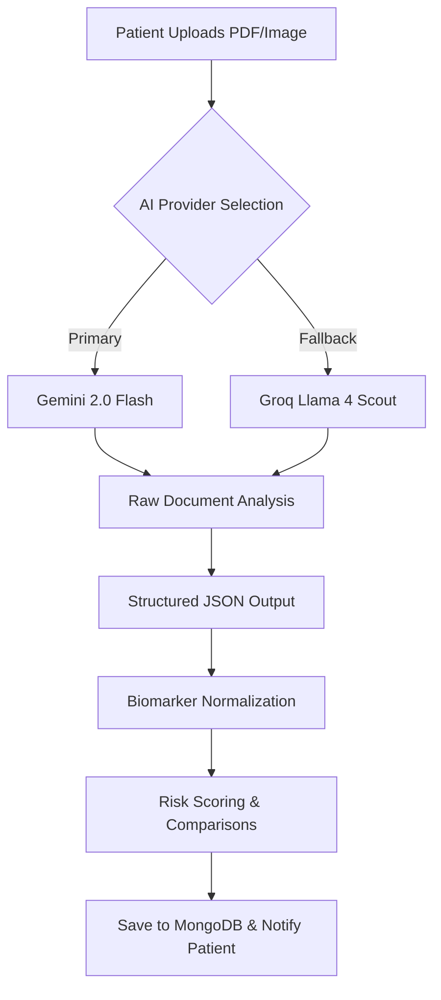

# Plumb Health AI: The Future of Clinical Intelligence
### Project Report | A Comprehensive "A to Z" Overview

---

## 1. Executive Summary
**Plumb Health AI** is an enterprise-grade medical lab report analysis and diagnostic summary platform. It bridges the gap between complex clinical data and patient understanding by leveraging state-of-the-art Multimodal LLMs. The platform decodes raw medical documents (PDFs, Images) into structured, actionable health insights, providing patients with a professional-grade clinical dashboard.

---

## 2. Core Value Proposition
- **Decipher Complexity**: Automatically extracts and explains hundreds of biomarkers.
- **Actionable Intelligence**: Moves beyond data to provide specific diet, lifestyle, and exercise guidance.
- **Visual Clarity**: Transforms dry reports into vibrant, interactive health trends.
- **Privacy & Security**: Built with a robust authentication and document handling layer.

---

## 3. Key Feature Suite

### 🧪 Advanced Lab Analysis
The "brain" of the system. Patients upload pathology reports, and the AI performs:
- **Biomarker Extraction**: Precision mapping of results, units, and reference ranges.
- **Risk Scoring**: A proprietary 0-100 health risk index based on clinical deviations.
- **Clinical Narrative**: A 3-5 sentence doctor-style summary written in plain language.

### 📈 Health Trend Tracking
- **Historical Comparison**: Automatically detects improvements or regressions compared to previous reports.
- **Interactive Recharts**: Dynamic visualization of biomarkers over time.
- **Normal Range Guards**: Visual indicators that highlight tests requiring urgent attention.

### 🥗 AI Nutrition & Diet Tracker
- **Meal Analysis**: Real-time analysis of food intake.
- **Nutrient Mapping**: Correlates dietary habits with specific lab biomarkers (e.g., suggesting low-sodium meals for high blood pressure).

### 🏋️ Personalized Lifestyle & Exercise
- **Biomarker-Driven Workouts**: Recommends exercises based on specific health needs (e.g., "Brisk Walking" for cardiovascular health).
- **Video Integration**: Directly embeds high-quality YouTube instructional videos to ensure proper form.

---

## 4. Technology Stack

### **Frontend Architecture**
- **Framework**: React 18 (Vite) for lightning-fast performance.
- **Styling**: Tailwind CSS v4 with a custom "Clinical Light" design system.
- **Animations**: Framer Motion for premium micro-interactions and transitions.
- **Typography**: Outfit (Headings) and Inter (Body) for a high-end, professional aesthetic.
- **Charts**: Recharts for responsive, accessible data visualization.

### **Backend Infrastructure**
- **Environment**: Node.js & Express.js.
- **Database**: MongoDB with Mongoose ODM for scalable health data storage.
- **Storage**: Multer for secure file ingestion.
- **Mailing**: Nodemailer with custom HTML templates for transaction receipts and notifications.

### **AI & LLM Strategy (The "Unified Engine")**
Plumb Health AI uses a **Unified Prompt-Chaining Architecture** with multi-provider redundancy:
1. **Primary**: **Google Gemini 2.0 Flash** (Multimodal Vision) — Direct raw byte analysis of medical documents.
2. **Fallback**: **Groq (Llama 4 Scout)** — High-speed vision-based analysis.
3. **Tertiary**: **Groq (Llama 3.3 70B)** — Text-extraction fallback using `pdf-parse`.

---

## 5. Architectural Deep Dive: Unified LLM Analysis

The platform implements a sophisticated normalization layer to ensure data consistency across different labs and formats.

### **Biomarker Alias System**
To prevent data fragmentation, the system uses a canonical alias map (e.g., mapping "Hb", "Hgb", and "Haemoglobin" all to a single "Hemoglobin" record) ensuring historical trends are always accurate.

---

## 6. Design Philosophy: "Clinical Light"
Plumb Health AI moves away from the "dark mode" tech trend in favor of a **Premium Clinical Aesthetic**:
- **Palette**: Pure whites (#FFFFFF), Slate Grays, and Clinical Blues.
- **Shadows**: Soft, blue-tinted elevation shadows for a depth-rich, breathable UI.
- **Components**: Rounded corners (2xl), glassmorphism effects, and high-contrast typography for readability.

---

## 7. Business & Monetization
- **PRO Membership**: A subscription-based tier offering unlimited AI analysis, historical tracking, and priority consultations.
- **Transaction Flow**: Integrated simulated Stripe payment processing with automated PDF invoice generation.

---

## 8. Conclusion & Future Roadmap
Plumb Health AI is not just a tool; it is a personal health companion. 
**Future Plans include:**
- **Real-time Vital Integration**: Connecting with Apple Health & Google Fit.
- **AI Consultation Bot**: A 24/7 medical assistant for immediate health queries.
- **Multi-Language Support**: Expanding clinical intelligence to global patients.

---
**Prepared By**: Antigravity AI
**Date**: May 14, 2026
**Status**: Premium / Final Release Candidate
