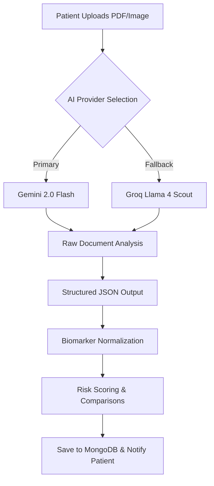

# Plumb Health AI: Clinical Intelligence Platform


**Plumb Health AI** is an enterprise-grade medical lab report analysis and diagnostic summary platform. It bridges the gap between complex clinical data and patient understanding by leveraging state-of-the-art Multimodal LLMs. The platform decodes raw medical documents (PDFs, Images) into structured, actionable health insights, providing patients with a professional-grade clinical dashboard.

---

## 🧪 Key Features

### 1. Advanced Lab Analysis
The "brain" of the system. Patients upload pathology reports (PDF, JPG, PNG), and the AI performs:
- **Biomarker Extraction**: Precision mapping of results, units, and reference ranges.
- **Risk Scoring**: A proprietary 0-100 health risk index based on clinical deviations.
- **Clinical Narrative**: A 3-5 sentence doctor-style summary written in plain language.

### 2. Health Trend Tracking
- **Historical Comparison**: Automatically detects improvements or regressions compared to previous reports.
- **Interactive Visualizations**: Dynamic charts built with Recharts, categorizing patient tests by normal ranges and flagged indicators.
- **Normal Range Guards**: Visual indicators that highlight tests requiring urgent attention.

### 3. AI Nutrition & Diet Tracker
- **Meal Analysis**: Real-time analysis of food intake.
- **Nutrient Mapping**: Correlates dietary habits with specific lab biomarkers (e.g., suggesting low-sodium meals for high blood pressure).

### 4. Personalized Lifestyle & Exercise
- **Biomarker-Driven Workouts**: Recommends exercises based on specific health needs.
- **Video Integration**: Directly embeds instructional content to ensure proper form.

---

## 🛠️ Technology Stack

### **Frontend**
- **Framework**: React 18 (Vite)
- **Styling**: Tailwind CSS (Custom "Clinical Light" design system)
- **Animations**: Framer Motion
- **Charting**: Recharts
- **Icons**: Lucide React

### **Backend**
- **Core**: Node.js, Express.js
- **Database**: MongoDB (Mongoose ODM)
- **Authentication**: JWT + bcrypt
- **File Handling**: Multer, `pdf-parse`, `pdf-img-convert`
- **Mailing**: Nodemailer (Professional HTML templates)

### **AI & LLM Strategy**
The platform uses a **Unified Prompt-Chaining Architecture** with multi-provider redundancy:
1. **Primary**: Google Gemini 2.0 Flash (Multimodal Vision)
2. **Fallback**: Groq (Llama 4 Scout / Llama 3.3 70B)

---

## 📐 System Architecture



---

## 🚀 Getting Started

### Prerequisites
- **Node.js** (v18+)
- **MongoDB** (Local or Atlas)
- **API Keys**: Google Gemini API & Groq API

### Installation

1. **Clone the repository**:
   ```bash
   git clone https://github.com/anukalpdwi/Plumb-Health.git
   cd medisense-ai
   ```

2. **Backend Setup**:
   ```bash
   cd backend
   npm install
   ```
   Create a `.env` file in the `backend` directory:
   ```env
   PORT=5000
   MONGODB_URI=your_mongodb_uri
   JWT_SECRET=your_jwt_secret
   GEMINI_API_KEY=your_gemini_key
   GROQ_API_KEY=your_groq_key
   EMAIL_USER=your_email
   EMAIL_PASS=your_app_password
   CLIENT_URL=http://localhost:3000
   ```
   Start the backend:
   ```bash
   npm run dev
   ```

3. **Frontend Setup**:
   ```bash
   cd ../frontend
   npm install
   ```
   Start the frontend:
   ```bash
   npm run dev
   ```

---

## 📄 License
This project is licensed under the ISC License.

---
